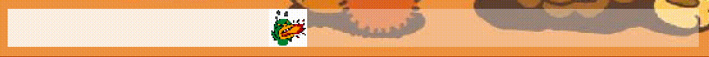

# Project FriendsPang 소개

### 요약

- 프로젝트 기간 : 2021.09.4 ~ 20201.09.11
- 프로그래밍 연습을 위해 인기 모바일 게임 애니팡 스타일의 게임을 카카오 캐릭터를 사용해 구현하였습니다.

### 사용 기술

- 순수 Java, Java AWT

### 프로그램 동작 모습

- **메인 화면 입니다.**
    1. “게임 시작”, “랭킹 보기”, “나가기” 세 종류의 버튼이 있습니다.

 
</img>
 
        
    
- **게임 화면 입니다.**
    1. “Game Start”를 누르면 게임이 바로 시작됩니다. 빈 보드판에서 카카오 캐릭터들이 채워지기 시작합니다.
        
 
</img>
 
        
    3. 같은 종류의 캐릭터가 3개 이상 일렬로 배치된다면 없어지고, 판이 다시 채워지며, 점수를 얻습니다.

 
</img>
 
        
    5. 같은 종류의 캐릭터가 3개 이상 배치를 할 수 없다면 캐릭터 자리 교환이 이루어 지지 않습니다.

 
</img>
 
        
    6. 타이머 동작 입니다. 타임 아웃이 다 다를 수록 색깔이 조급하게 변합니다.
    
 
</img>
 
        
    7. 더 이상 정답이 없을 때, 판이 새롭게 갱신되어 내려옵니다.

 
</img>
 
        
    8. 점수판 동작 입니다.

 
</img>
 
        
    9. 게임 아웃시 ‘끝’이라는 큼지막한 글자가 내려오고 랭킹등록을 할 수 있도록 ‘next’버튼이 올려옵니다.
        
 
</img>
 
        
- **랭킹관련 화면입니다.**
    1. 랭킹 등록 화면 입니다.
        

 
</img>
 
        
    3. 랭킹을 볼 수 있는 화면 입니다.
        

 
</img>
 

- **게임 플레이 전체영상 입니다.(화살표를 누르세요)**
    
    [화면 기록 2022-05-09 오전 10.23.42.mov](Project%20FriendsPang%20%E1%84%89%E1%85%A9%E1%84%80%E1%85%A2%20eedaaed9ec714d5494fa6f2f0a5888ab/%E1%84%92%E1%85%AA%E1%84%86%E1%85%A7%E1%86%AB_%E1%84%80%E1%85%B5%E1%84%85%E1%85%A9%E1%86%A8_2022-05-09_%E1%84%8B%E1%85%A9%E1%84%8C%E1%85%A5%E1%86%AB_10.23.42.mov)
    

### 프렌즈팡의 프로그램 플로우

- **화면 이동 플로우 입니다.**

 
</img>
 
    
- **게임 로직 플로우**
    1. “Game Start”를 누르면 게임이 시작되고 텅 빈 게임보드에 랜덤으로 프렌즈 캐릭터가 채워집니다.
        - 이때 조건부 랜덤으로 보드가 채워지게 됩니다.
        - 플레이어가 게임보드에 개입하기 전이므로 새롭게 보드가 채워질때는 저절로 정답처리가 되는 열이 없게하고 싶었습니다.
        - 여기서 정답처리란, 같은 종류의 캐릭터가 3개 이상이 일렬배치가 되면, 보드에서 사라지고 점수를 얻는 것을 말합니다.
        - 따라서 보드가 채워지기전에 미리 검사를 합니다. 검사의 로직은 다음과 같습니다.
            
            (1) 실제 플레이어에 보여지는 보드가 아닌 임시의 빈 보드에 랜덤으로 캐릭터를 채운다
            
            (2) 49개의 자리 중  답이 있으면 정답처리 한 후 빈 곳에 다시 랜덤으로 캐릭터를 채워 넣는다.
            
            (3) 더 이상 정답처리가 되지 않을 때 까지 (1)번~(2)번을 반복한다.
            
            (4) 보드판을 순회하면서 각 캐릭터가 상하좌우로 움직였을 때 정답이 있는지 확인한다.
            
            (5) 정답이 하나도 없다면 다시 (1)번부터 진행하고, 정답이 있다면 Queue 자료구조를 하나 만들어  임시 보드판을 제일 left-bottom에 있는 캐릭터부터 제일 right-top 까지 순서대로 넣습니다.
            
        - Queue 자료구조로 실제 보드에 캐릭터를 채울 때는 보드의 맨 윗줄(1행)에만 빈 곳이 없도록 채웁니다.
        - 그 후 캐릭터가 자신의 아랫공간이 빈 곳인지 확인 후 빈 곳이면 아래를 채우러 이동합니다.
    2. 게임보드에 캐릭터가 꽉 차면 플레이어는 캐릭터를 이동시킬 수 있습니다.
        - 3개 이상이 일렬로 배치 될 시에 보드는 캐릭터의 자리바꿈을 허용합니다.
        - 그렇지 않으면 캐릭터의 자리가 잠시 바뀌었다가 게임보드에 의해 다시 되돌아갑니다.
    3. 3개 이상이 일렬로 배치된다면, 보드에서 사라지고 점수를 얻습니다. 
        - 이때 없어진 자리에는 그 위에 있는 캐릭터들이 차례로 아래로 내려와 자리를 채우고,
        - 마지막으로 맨 윗줄(1행)에 빈 자리는 게임보드가 랜덤으로 캐릭터를 하나 채우게 됩니다.
    4. 타이머가 왼쪽에서 시작해 오른쪽 끝까지 다 다를 때까지 게임을 진행합니다.
    5. 게임이 끝나면, 끝이라는 커다란 글자가 위에서 내려고오 자신의 점수를 이름과 함깨 랭킹 화면에 남길 수 있는 입력 화면으로 넘어기기 위한 ‘next’버튼이 올라옵니다.
    6. 랭킹을 입력하는 화면은 알파벳 대소문자 버튼으로 구성하여 간단히 이니셜등을 입력할 수 있도록 하였습니다. 등록한 점수와 이름은 랭킹을 관리하는 파일에 쓰여지게 됩니다.

### 개발 중 문제 해결 과정

- 게임 로직과 화면 구현에 대하여
    - 화면 상에 그리는 캐릭터들의 Canvas 픽셀 좌표를 갖고 게임에서 진행하는 여러 로직들을 구현하기에는 빈 보드에 캐릭터를 채우기 전, 보드의 유효성을 검증하는 로직이나, 정답처리 시 캐릭터 제거 후 새 캐릭터를 채워 넣는 로직 등을 구현하기가 매우 까다롭거나 불가능하다고 느꼈습니다.
    - 따라서 게임 로직을 계산하는 2차원 배열의 게임보드를 만들어 이것을 갖고 여러 게임 로직을 빠르게 계산하도록 하였습니다.
    - 후에 화면에 픽셀 좌표를 갖고 캐릭터를 그릴 때는 해당 캐릭터가 위치한 2차원 배열의 인덱스와 화면에서 보드가 위치한 원점 픽셀 좌표, 보드 한칸의 단위 크기를 갖고 픽셀 좌표를 계산해 화면에 그려지도록 하였습니다.
- 캐릭터의 자리를 바꿀 때 사용하는 마우스 이벤트에 대하여
    - 사용자가 캐릭터를 마우스 혹은 터치를 이용할 때 조금의 불편함도 없게 하고 싶었습니다.
    - 그러기 위해서는 자리를 바꿀 캐릭터 두 개를 지목을 할 때 대충(느슨하게)해도 원하는 캐릭터를 선택할 수 있도록 하였습니다.
    - 첫번째 캐릭터를 지목할 때는 마우스 mousePressed 이벤트를 통해 좌표를 수집하고, 두번째 캐릭터를 지목할 때는 마우스 mouseReleased 이벤트를 통해 좌표를 수집합니다.
    - 이때 mouseReleased 이벤트에서 좌표를 수집할 때는 꼭 두번째 캐릭터가 위치한 좌표 범위 내에서 발생할 때만 수집하는 것으로 하지 않았습니다.
    - mousePressed 이벤트가 발생한 좌표를 원점으로 y = x 축과 y = -x축 두 개를 사용해 공간을 4분할을 하고, mouseReleased가 발생한 좌표에 해당하는 공간에 있는 인접한 캐릭터를 두번째 캐릭터를 지목합니다.
- 점수판 구현에 대하여
    - 숫자를 표시하는 이미지는 0부터 9까지의 이미지를 수직방향으로 연속으로 이어붙혀 프레임이 진행될 때마다 한 픽셀씩 움직이는 방식으로 약간의 애니메이션으로 점수판이 동작하도록 하였습니다.
    - 정답처리되어 얻은 점수를 점수판이 확인하여, 해당 점수까지 점수가 상승하는 식으로 구현하였습니다.
